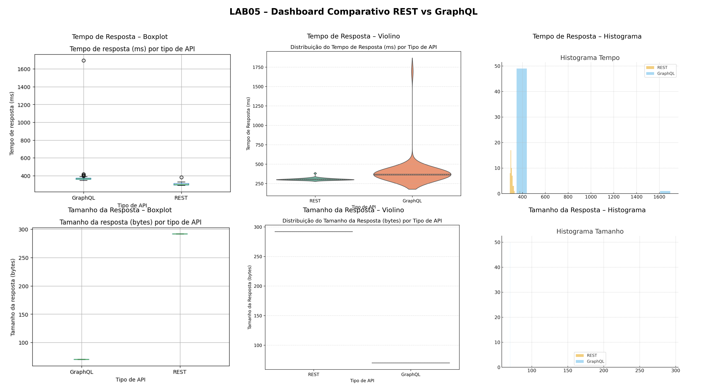

# LAB05 — GraphQL vs REST: Um Experimento Controlado

Este repositório contém a implementação completa do Laboratório 05 da disciplina de Laboratório de Experimentação de Software (PUC Minas).  
O objetivo do experimento é avaliar comparativamente APIs REST e GraphQL quanto ao desempenho e ao volume de dados trafegados, respondendo às seguintes perguntas de pesquisa:

- **RQ1:** Consultas GraphQL são mais rápidas do que consultas REST?
- **RQ2:** Consultas GraphQL retornam respostas menores do que consultas REST?

O projeto inclui scripts de execução do experimento, coleta de dados, análise estatística e visualizações gráficas que permitem a reprodução integral do estudo.

---

## 1. Introdução

APIs REST são amplamente utilizadas na construção de sistemas distribuídos, operando por meio de endpoints e recursos previamente definidos. Em contrapartida, o GraphQL propõe uma abordagem declarativa, permitindo que o cliente especifique exatamente quais dados deseja obter, o que pode reduzir o volume de dados transferidos e aumentar a flexibilidade das consultas.

Apesar da crescente adoção do GraphQL, ainda não há consenso sobre seus reais benefícios em comparação ao REST, especialmente em termos de desempenho e eficiência. Nesse contexto, este laboratório tem como objetivo realizar um experimento controlado para avaliar quantitativamente essas duas abordagens.

As seguintes perguntas de pesquisa foram definidas:

- **RQ1:** Consultas GraphQL são mais rápidas que consultas REST?
- **RQ2:** Consultas GraphQL retornam respostas menores que consultas REST?

Hipóteses:

- **H0_RQ1:** Não há diferença significativa no tempo de resposta entre REST e GraphQL.  
- **H1_RQ1:** GraphQL apresenta menor tempo de resposta que REST.

- **H0_RQ2:** Não há diferença significativa no tamanho das respostas entre REST e GraphQL.  
- **H1_RQ2:** GraphQL apresenta respostas menores que REST.

---

## 2. Metodologia

### 2.1 APIs Testadas

Foram utilizadas APIs públicas e estáveis:

- **REST:** https://jsonplaceholder.typicode.com/posts/1  
- **GraphQL:** https://graphql-pokeapi.graphcdn.app/

Consulta GraphQL utilizada:

```graphql
query {
  pokemon(name: "pikachu") {
    id
    name
    height
    weight
  }
}
```

### 2.2 Variáveis do Experimento

- **Variável Independente:** Tipo de API (REST ou GraphQL)  
- **Variáveis Dependentes:**
  - Tempo de resposta (ms)
  - Tamanho da resposta (bytes)

### 2.3 Procedimento Experimental

- Foram realizadas **50 medições** REST e **50 medições** GraphQL.  
- Todas as medições foram executadas no mesmo ambiente e rede.  
- Os dados resultantes foram armazenados em `resultados_experimento.csv`.

Scripts utilizados:

- `run_experiment.py`: coleta das medições  
- `analyze_results.py`: análises estatísticas e geração de gráficos  

---

## 3. Resultados

A análise dos resultados foi conduzida por meio de gráficos estatísticos (boxplots, histogramas e gráficos de violino), permitindo observar tendências centrais, dispersão e presença de outliers.

### 3.1 Gráficos

Tempo de resposta:
- `boxplot_tempo.png`
- `violino_tempo.png`
- `hist_tempo.png`

Tamanho da resposta:
- `boxplot_tamanho.png`
- `violino_tamanho.png`
- `hist_tamanho.png`

Dashboard consolidado:
- `dashboard_lab05.png`

A seguir são apresentados os gráficos utilizados para análise:



Gráficos individuais (opcional para inspeção detalhada):


---

## 4. Discussão

### 4.1 RQ1 — Tempo de Resposta

A partir dos gráficos de tempo (boxplot, violino e histograma), observou-se que:

- O **REST apresentou menor tempo médio e mediano** em comparação ao GraphQL.
- O **GraphQL apresentou maior variabilidade** no tempo de resposta.
- Foi observado um **outlier significativo** no GraphQL, indicando instabilidade em algumas execuções.
- O REST mostrou maior concentração de valores, sugerindo **maior previsibilidade**.

**Conclusão (RQ1):** não há evidência experimental de que GraphQL seja mais rápido.  
➡️ **H0_RQ1 não foi rejeitada.**

### 4.2 RQ2 — Tamanho da Resposta

A partir dos gráficos de tamanho (boxplot, violino e histograma), observou-se que:

- As respostas GraphQL foram **consistentemente menores**.
- As respostas REST foram **significativamente maiores** no cenário avaliado.
- Valores aproximados observados:
  - GraphQL: ~**70 bytes**
  - REST: ~**292 bytes**

**Conclusão (RQ2):** GraphQL retornou respostas significativamente menores.  
➡️ **H0_RQ2 foi rejeitada.**

---

## 5. Conclusões Finais

- O **REST** foi superior em **velocidade** e **estabilidade** (menor variabilidade).
- O **GraphQL** foi superior em **economia de dados** (respostas menores).
- A escolha entre REST e GraphQL depende dos requisitos da aplicação (latência, banda, flexibilidade).

---

## 6. Como Reproduzir o Experimento

```bash
pip install requests pandas matplotlib seaborn pillow
python run_experiment.py
python analyze_results.py
python g_d.py
```

---

## 7. Ameaças à Validade

- APIs públicas podem variar conforme a carga do servidor.
- A rede influencia diretamente as medições.
- Apenas um endpoint REST e uma query GraphQL foram avaliados.

---

## 8. Autores

- Augusto Noronha  
- Pedro Maximo  
- David Leong  
