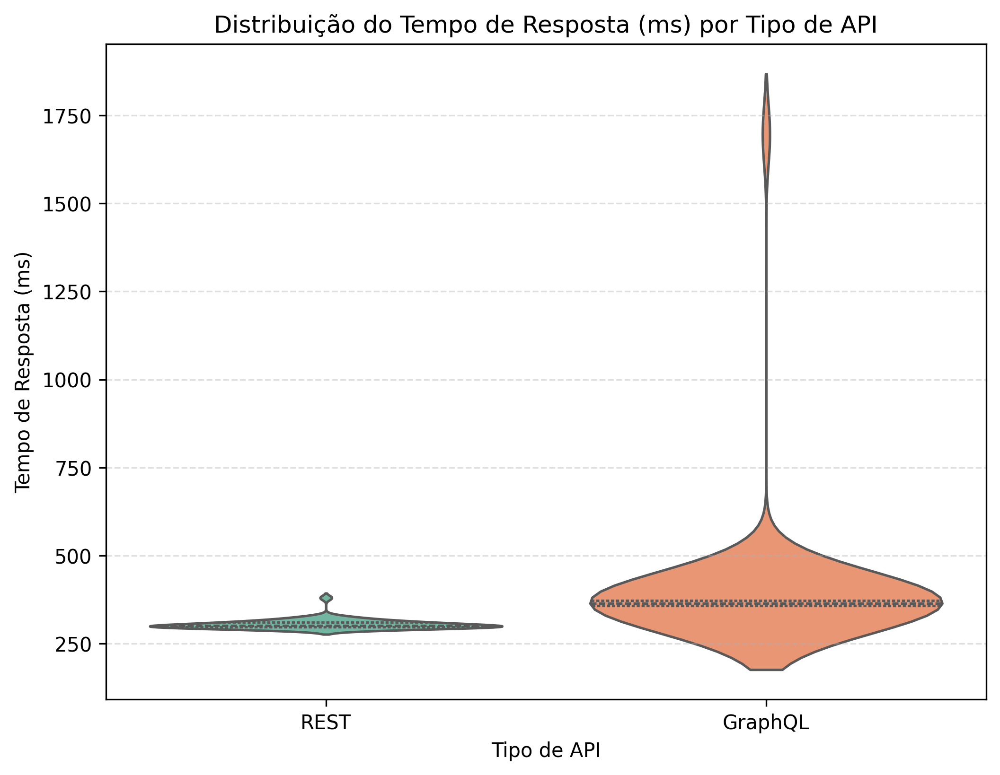
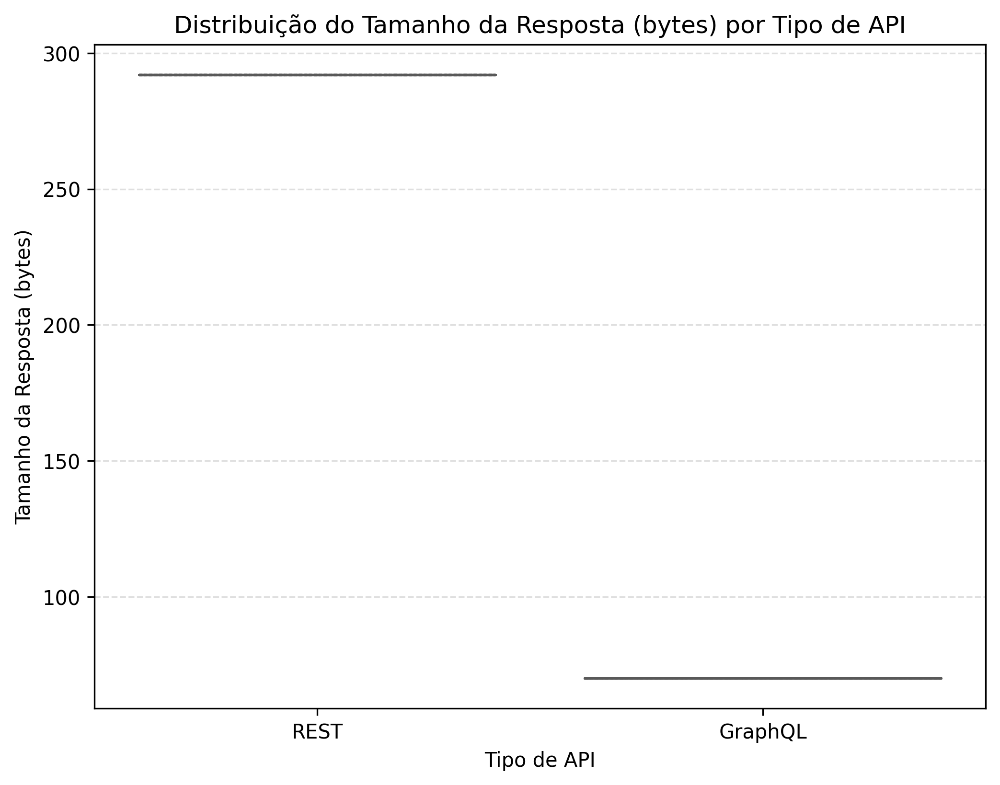
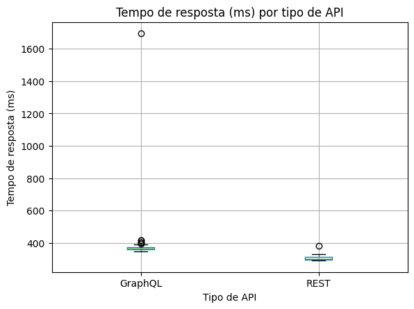
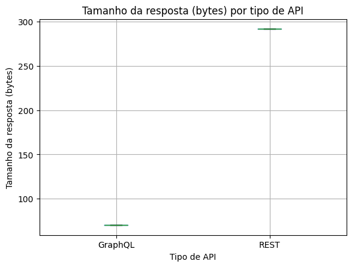
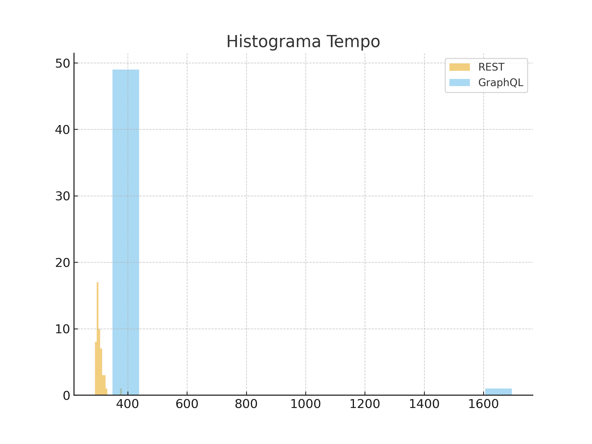
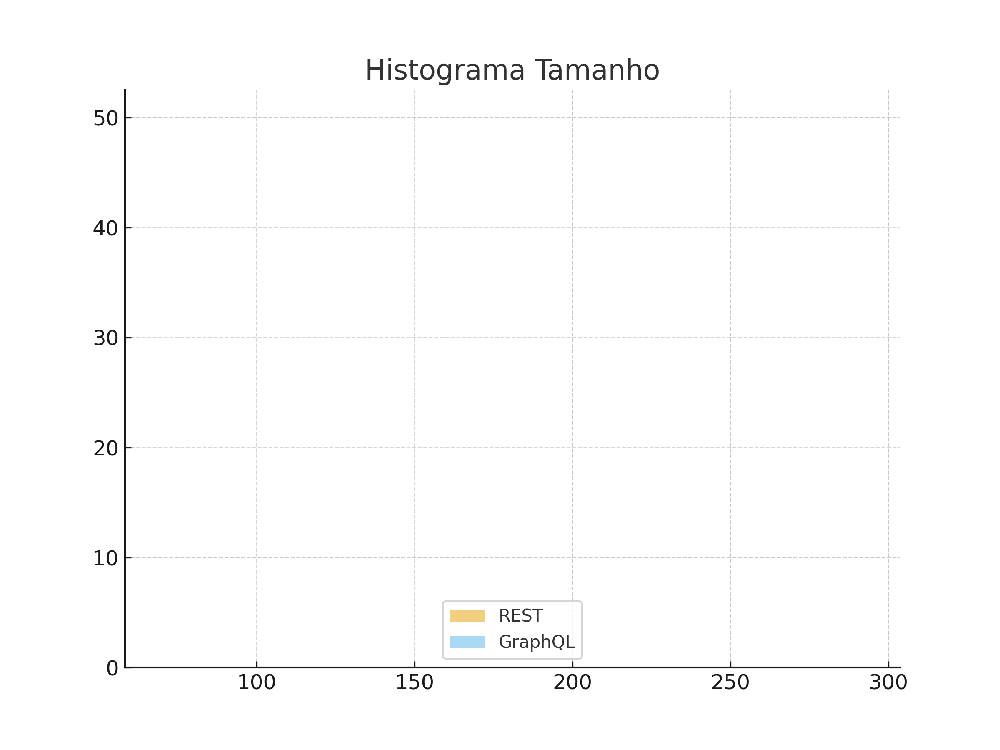

# LAB05 — GraphQL vs REST: Um Experimento Controlado

Este repositório contém a implementação completa do Laboratório 05 da disciplina de Experimentação em Engenharia de Software (PUC Minas).  
O objetivo é avaliar comparativamente APIs REST e GraphQL em relação às seguintes perguntas de pesquisa:

- RQ1: Consultas GraphQL são mais rápidas do que consultas REST?
- RQ2: Consultas GraphQL retornam respostas menores do que consultas REST?

O projeto inclui scripts, coleta de dados, análise estatística e visualizações que permitem a reprodução integral do experimento.

---

## 1. Introdução

REST é amplamente utilizado na construção de APIs, operando com endpoints e recursos definidos. GraphQL propõe uma abordagem declarativa, permitindo ao cliente especificar exatamente quais dados deseja, o que pode resultar em menor consumo de banda e maior eficiência em certos cenários.

Para este experimento, foram definidas as seguintes perguntas de pesquisa:

- RQ1: Consultas GraphQL são mais rápidas que consultas REST?
- RQ2: Consultas GraphQL retornam respostas menores que consultas REST?

Hipóteses:

- H0_RQ1: Não há diferença significativa no tempo de resposta entre REST e GraphQL.  
- H1_RQ1: GraphQL apresenta menor tempo de resposta.

- H0_RQ2: Não há diferença significativa no tamanho das respostas entre REST e GraphQL.  
- H1_RQ2: GraphQL apresenta respostas menores.

---

## 2. Metodologia

### 2.1 APIs Testadas

Foram utilizadas APIs públicas e estáveis:

- REST: https://jsonplaceholder.typicode.com/posts/1
- GraphQL: https://graphql-pokeapi.graphcdn.app/

Query utilizada:

```graphql
query {
  pokemon(name: "pikachu") {
    id
    name
    height
    weight
  }
}
```

### 2.2 Variáveis

- Variável Independente: Tipo de API (REST ou GraphQL)  
- Variáveis Dependentes:
  - Tempo de resposta (ms)
  - Tamanho da resposta (bytes)

### 2.3 Procedimento Experimental

- Foram realizadas 50 medições REST e 50 medições GraphQL.  
- Todas as medições foram executadas no mesmo ambiente e rede.  
- Os dados resultantes foram armazenados em `resultados_experimento.csv`.

Scripts utilizados:

- `run_experiment.py`: coleta das medições  
- `analyze_results.py`: análises estatísticas e geração de gráficos  

---

## 3. Resultados

A seguir são apresentados os gráficos utilizados para análise.  
Placeholders das imagens:

```






```

---

## 4. Discussão

### 4.1 RQ1 — Tempo de Resposta

- A API REST apresentou menor tempo médio de resposta.
- A variabilidade do tempo de resposta da API GraphQL foi maior.
- Um outlier significativo foi observado em GraphQL.

Conclusão: não há evidência experimental de que GraphQL seja mais rápido.  
H0_RQ1 não foi rejeitada.

### 4.2 RQ2 — Tamanho da Resposta

- As respostas GraphQL apresentaram cerca de 70 bytes.  
- As respostas REST apresentaram cerca de 292 bytes.

Conclusão: GraphQL retornou respostas significativamente menores.  
H0_RQ2 foi rejeitada.

---

## 5. Conclusões Finais

REST foi superior em velocidade e estabilidade.  
GraphQL foi superior em economia de dados.  
A escolha entre eles depende dos requisitos da aplicação.

---

## 6. Como Reproduzir o Experimento

```
pip install requests pandas matplotlib seaborn
python run_experiment.py
python analyze_results.py
```

---

## 7. Ameaças à Validade

- APIs públicas podem variar conforme a carga.  
- A rede influencia diretamente as medições.  
- Apenas um endpoint REST e uma query GraphQL foram avaliados.

---

## 8. Autores

- Augusto Noronha  
- Pedro Maximo  
- David Leong  
